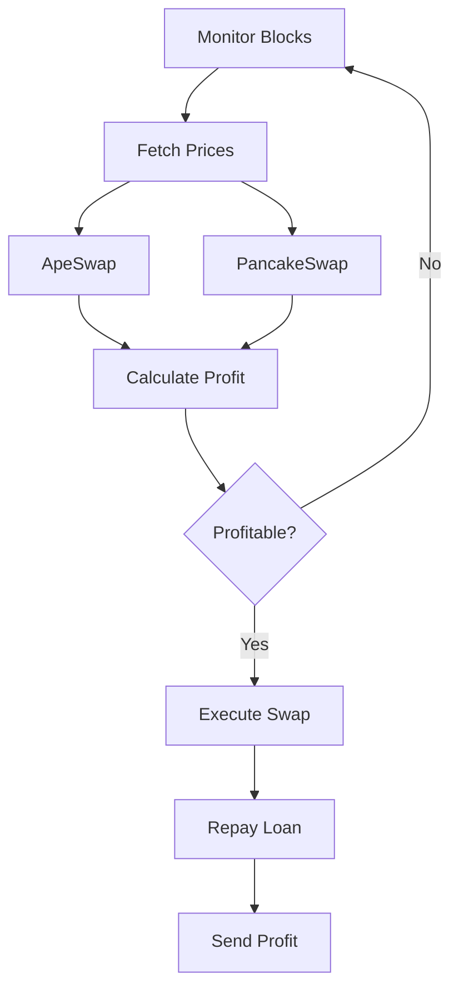

## BSC Flash Swap Arbitrage System Analysis Report

### Project Overview
The project implements a flash loan arbitrage bot on Binance Smart Chain that exploits price differences between PancakeSwap and ApeSwap DEXs. Key components include a Solidity smart contract (`ArbitrageExecutor.sol`) for flash swap execution, a Node.js script (`run-arbitrage.js`) for opportunity monitoring, and Truffle for contract management.

### Core Functionality
#### ArbitrageExecutor Contract
- **Mechanism**: Uses Uniswap V2 flash swap pattern
- **Key Methods**:
  - `startArbitrage()`: Initiates flash loans
  - `pancakeCall()`: Handles loan repayment and arbitrage execution
- **Swap Support**: Handles both token→ETH and ETH→token paths

#### Execution Script
- **Block Monitoring**: Listens for new blocks
- **Price Comparison**: Fetches prices from ApeSwap/PancakeSwap
- **Profit Calculation**: Accounts for fees (0.3%), gas costs, and price differences
- **Trade Execution**: Triggers contracts when profitable opportunities exist

### Workflow

### Improvement Recommendations
1. **Security Enhancements**:
   - Add reentrancy protection
   - Implement slippage tolerance
   - Create emergency withdrawal

2. **Performance Optimizations**:
   - Batch price requests
   - Optimize gas usage
   - Add rate limiting

3. **Monitoring**:
   - Telegram/Discord alerts
   - Profit tracking dashboard
   - System health checks
